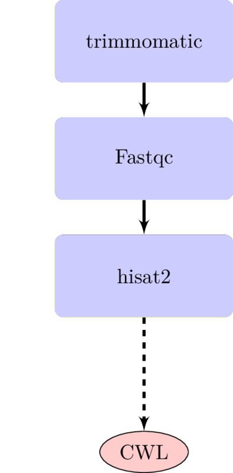

# ContainerInception
Step-by-step use cases of containers and workflows to package reproducible bioinformatics softwares.

## Purpose
TODO
By the end of this tutorial, the reader will have a working knowledge of packaging reusable workflows. The example in our use cases involve a typical quality control and mapping of RNA-seq data of Sorghum bicolor. 

## Workflow

## Use case 0: No containers and no CWL. [Click here on how to run it!](use\_case\_0/README.md)

- Most users fall in this categories. 
- It is difficult to update the modules, it does not scale, and reproducibility is not maintained. 
- Some people run them as bash script while others run them as individual software.

## Use case 1: Container(s) with no CWL [Click here on how to run it!](use\_case\_1/README.md)

- Docker users fall under this category.
- Docker is supposed to be using one thing at a time. For example one of the authors uses 1,000 lines to create a docker. 
- Difficult to swap in the wrapper script.
- Sometimes you have multiple containers but you have to string them together using bash script but it’s not easy stitch them and will mostly be hardcoded

## Use case 2: Both container(s) and CWL [Click here on how to run it!](use\_case\_2/README.md)

- It’s difficult to write them or no clear standard and everyone uses cwl. 
- It’s difficult to write but easier to edit them or swap them 
- Create docker container with tools to run the pipelines.
- Define modularity layers
- Launch/Run via CWLTool/Rabix

## Use case 3: Interacting workflows with CWL 
- Two interacting workflows, that is, one workflow (current one) and two other workflows (SNP calling and differential expression analysis)
- TODO

### System Requirements
To run our examples, your machine must meet the following requirements
- Unix-like operating system
- Python=2.7
- Docker
- trimmomatic=0.36
- fastqc=0.11.7
- hisat2=2.1.0
- cwltool=1.0.20180330141240

## Disclaimer
TODO
