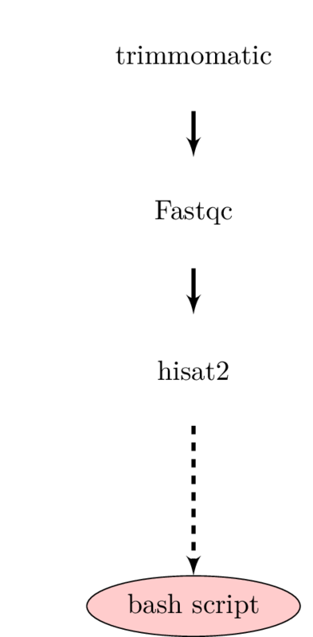

# **Container Inception Tutorial**

## Outcomes

By the end of this tutorial, the reader will have a working knowledge of packaging reusable workflows. 

The example in our use cases involve a typical quality control and mapping of RNA-seq data of Sorghum bicolor. 

## Use case 0: No containers and no CWL. 

Most users fall in this categories. 
It is difficult to update the modules, it does not scale, and reproducibility is not maintained. 
Some people run them as bash script while others run them as individual software. 

Use case 1: Containers with no CWL

Container and no cwl: Most users who use Docker fall under this category. When using containers you are mixing 0 and 1. Docker is supposed to be using one thing at a time. For example one of the authors uses 1,000 lines to create a docker. Difficult to swap in the wrapper script.

[Fastqc -> trimmomatic -> Fastqc -> tophat2] (bash script)
Make a docker image that contains 4 softwares

## Use case 1.1 (Nick)

Multiple (individual) containers with no cwl. Sometimes you have multiple containers but you have to string them together using bash script but it’s not easy stitch them and will mostly be hardcoded

[Fastqc] -> [trimmomatic] -> [Fastqc] -> [tophat2]  (bash script)

Individual containers for each software and no cwl. We will write a bash script

## Use case 2 (Mike)

Have containers and have cwl/workflow descriptor: It’s difficult to write them or no clear standard and everyone uses cwl. It’s difficult to write but easier to edit them or swap them 

[Fastqc] -> [trimmomatic] -> [Fastqc] -> [tophat2]  (cwl/nf)

Write a cwl/nf for these individual containers

## Use case 3.1: Container with CWL 

[[Fastqc] -> [trimmomatic] -> [Fastqc] -> [tophat2]  (cwl/ )]

Create docker container with tools to run the pipelines.
Define modularity layers
Launch/Run via CWLTool/Rabix

### Requirements
Docker
cwltool=1.0.20180330141240

### To run the workflow
cwltool --non-strict pipeline_name.cwl pipeline_name.cwl.json

### To modify modules
Edit pipeline_name.cwl to describe specific steps (in our case pipelines) and the json that pertains to the module. ( NOTE: Ideally this should be done via rabix, and a more simple experience should be available to the user)

## Use case 3.2: Interacting workflows:
Two interacting workflows- one workflow (current one) and two other workflows (SNP calling and differential expression analysis)

[[Fastqc] -> [trimmomatic] -> [Fastqc] -> [tophat2]  (cwl/nf)]

+

[[Cuffmerge] -> [cuffdiff] -> [cummerbund] (cwl/nf)] (example pipeline)

## System requirements
To run the examples in our tutorial, you machine must meet the following requirements
python=2.7
GNU bash=
fastqc=0.11.7
trimmomatic=0.36
bowtie=2.3.4.1
tophat=2.1.1