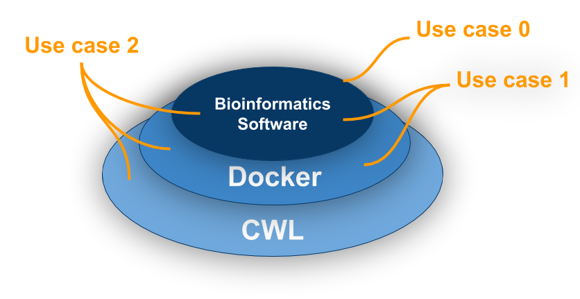

# ContainerInception
Step-by-step use cases of containers and workflows to package reproducible bioinformatics softwares.

## Purpose
By the end of this tutorial, the reader will have a working knowledge of packaging reusable workflows. The example in our use cases involve a typical quality control and mapping of RNA-seq data of Sorghum bicolor. 

## Workflow

## Use case 0: No containers and no CWL. [Click here for bad code. How not to do things!](use\_case\_0/README.md)
This is probably how you're doing things right now. It is difficult to update the modules, it does not scale, and reproducibility is not maintained.

## Use case 1: Single container with no CWL [Click here!](use\_case\_1/README.md)
You build a pipeline on your Macbook Air and everything works well on a minimal data set. Your full blown experiment requires multiple cores and you need to move the pipeline to a powerful server that runs Ubuntu. Your software may fail to run on Ubuntu, and getting that old shell script to run on the new server is cumbersome. The following approach avoids this problem. 

## Use case 1.1: Multiple Containers with no CWL [Click here!](use\_case\_1.1/README.md)
The Docker philosophy states that every container should serve a single function. This makes it easier to update a single tool without worrying how that affects the overall project. For instance, say you want to redo your analysis, but this time you want to use a different read mapper, say `tophat2` instead of `hisat2`. Containerizing your individual tools allows both modification (grabbing a different Docker image) and portability between different operating systems. 

## Use case 2: Both container(s) and CWL [Click here!](use\_case\_2/README.md)
Even with containerized individual tools one still needs to write a shell script to stitch them altogether. Instead, CWL requires explicitly defined inputs and outputs which in turn ensures standardization and reproducibility. Furthermore, CWL workflows can be compartmentalized in a (pulled/created) Docker image. 

## Use case 3: Interacting workflows with CWL [Click here!](use\_case\_3.2/README.md)
- Two interacting workflows, that is, one workflow (current one) and two other workflows (SNP calling and differential expression analysis)
- TODO

### System Requirements
To run our examples, your machine must meet the following requirements
- Unix-like operating system
- Python=2.7
- [Docker](https://docs.docker.com/install/)
- [cwltool=1.0.20180330141240](https://github.com/common-workflow-language/cwltool#install)
- [trimmomatic=0.36](http://www.usadellab.org/cms/?page=trimmomatic)
- [fastqc=0.11.7](https://www.bioinformatics.babraham.ac.uk/projects/fastqc/)
- [hisat2=2.1.0](https://ccb.jhu.edu/software/hisat2/manual.shtml#obtaining-hisat2)

## Disclaimer
TODO
