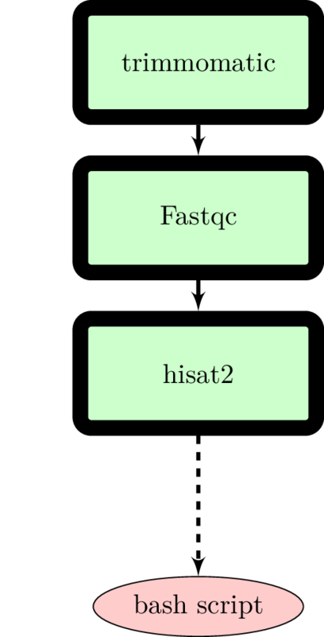

# Use Case 1.1



## Motivation
The Docker philosophy states that every container should serve a single function. This makes it easier to update a single tool without worrying how that affects the overall project. For instance, say you want to redo your analysis, but this time you want to use a different read mapper, say `tophat2` instead of `hisat2`. Containerizing your individual tools allows both modification (grabbing a different Docker image) and portability between different operating systems. 

# Requirements
- [Docker](https://docs.docker.com/install/)
```
sudo docker pull quay.io/biocontainers/trimmomatic:0.36--5
sudo docker pull fjukstad/fastqc
sudo docker pull limesbonn/hisat2
```

# Usage
> Make sure that the input files are in your current working directory before running.
```

Usage: ./uc-1.1.sh -r1 <READ1.fastq.gz> -r2 <READ2.fastq.gz> -a <adapters.fa> -g <ref.fa>

Options:
-r1      --read1     a read1 gzipped FASTQ file
-r2      --read2     a read2 gzipped FASTQ file
-a   --adapters      an adapters FASTA file
-t   --trimfile      a trim file for trimmomatic
-g   --genome-ref    a reference genome FASTA file
```

# Example:
```
./uc-1.1.sh -r1 sample_1_R1.fq.gz -r2 sample_1_R2.fq.gz -a Adapters.fa -g reference_genome.fa -t testfile_trimmomatic.txt
```
