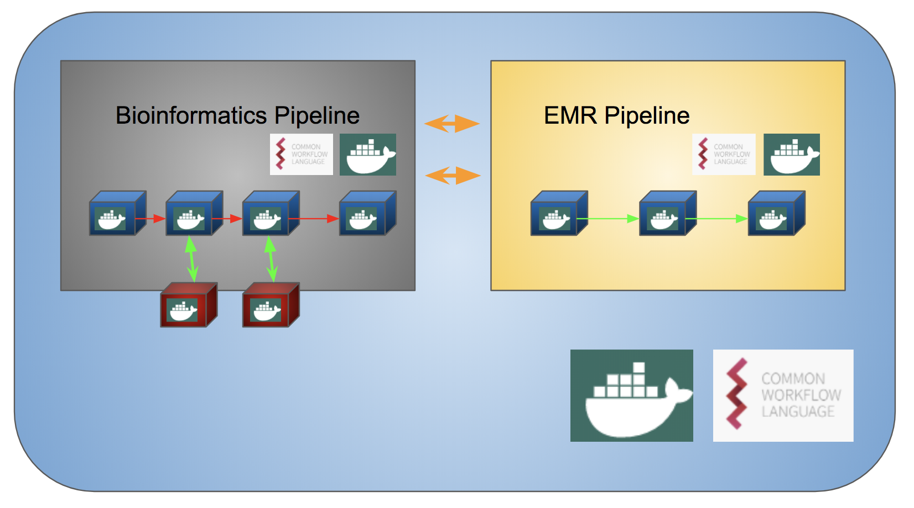

## TODO : Modulularize containers
### Use case 3: Containerized interaction
By containerize the tools, we can built their respective environments within the same network and therefore guarantee pipeline interaction.

The tools can be invoqued in a container invironment via CWL. This guantees modularization, and swapping components with out directly affecting the parameters of other components.
For this to work, the input and output parametrization needs to be defined identically in the replaced modules.

### NOTES
* To unzip file tar -zxvf `filename.zip`
